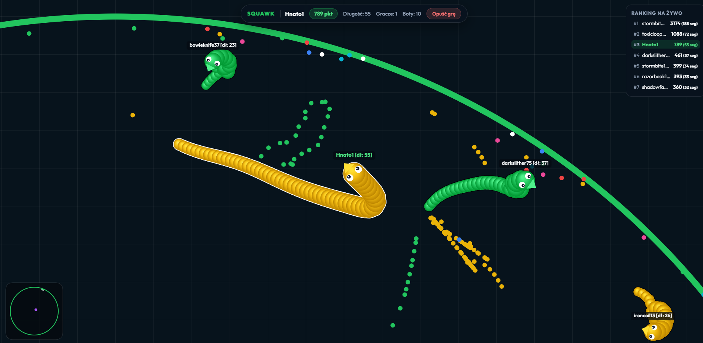
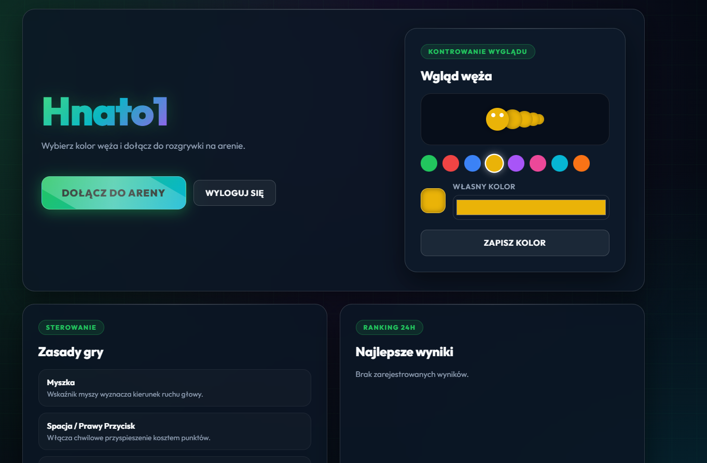

<div align="center">


**Fast-Paced Real-Time Multiplayer Snake Arena Game**


</div>

---

## 🐍 Welcome to the Arena!

Tired of slow, single-player snake games? **Squawk** is your ultimate escape. Designed from the ground up for competitive multiplayer and LAN play, it delivers lightning-fast, high-frequency gameplay, smart AI bots, and an interactive cyberpunk design. 

Customize your snake skin, compete against friends or bots, and climb to the top of the global leaderboard!

<div align="center">
  
</div>

---

## 🔥 Why Choose Squawk?

### 🎮 Unmatched Snake Action
- **Real-Time Multiplayer Engine:** Smooth, low-latency snake movements powered by ASP.NET Core SignalR WebSockets.
- **Smart Growth AI Bots:** Compete against intelligent bot players that dynamically hunt food and try to cut you off.
- **Glowing Boost Aura:** Sprint with style! Boosting activates a full-body glowing energy core and pulsing aura across all snake segments.

### 🎨 Cyberpunk Styling
Don't settle for boring screens. Immerse yourself!
- **Arcade HUD & Custom Skins:** Responsive HTML5 Canvas 2D engine with clean typography, metallic rank badges, and skin selectors.
- **Sleek Customization:** Choose your style and prepare your snake for battle.
- **High-DPI Rendering:** Silky smooth movement with client-side interpolation.

<div align="center">
  
</div>

---

## 🖥️ Powerful Yet Lightweight

Squawk isn't just a game client. It comes with a robust **Windows Desktop Host** that makes running and managing your server a breeze!

- 🚀 **Lightning Fast API:** High-performance tick rate driven by ASP.NET Core & SignalR.
- 🌐 **Modern Client:** Responsive React + TypeScript frontend served directly by the server.
- 📦 **Easy Deployment:** Packed into a single standalone executable (`Squawk.exe`). No external dependencies required!
- 🤖 **Server Controls:** WinForms GUI for starting the server and managing bot count in real-time.

---

## ⚙️ How to Get Started

It's easier than ever to set up your own Squawk server:

1. **Download:** Get the compiled `Squawk.exe` executable.
2. **Launch Host:** Open the `Squawk.exe` desktop application.
3. **Start Server:** Click **"Włącz Serwer"** in the host GUI. It will listen on `0.0.0.0:5007` for LAN access and `127.0.0.1:5006`.
4. **Play:** Open `http://localhost:5007` (or the LAN IP shown) in your browser, log in, and enter the arena!

---

## 🛠 Building from Source

To compile the entire client and bundle it into a standalone `Squawk.exe`:

```powershell
powershell -ExecutionPolicy Bypass -File .\build_release.ps1
```

The script automatically:
1. Builds the React/Vite client (`npm run build`).
2. Embeds client assets and the Win32 icon (`logo.ico`) into the C# project.
3. Publishes a single-file self-contained `Squawk.exe` in the workspace folder.

---

## 📂 Project Structure

```text
Squawk/
├─ Client/                  # React + Vite + TypeScript frontend
│  ├─ src/
│  │  ├─ components/       # UI Components (Login, Dashboard, Game, Leaderboards)
│  │  ├─ game/             # Canvas 2D Game Renderer & Client State
│  │  └─ index.css         # Cyberpunk Arcade Design System
│  └─ package.json
├─ Server/                  # C# .NET 11 Backend Host
│  ├─ Data/                # EF Core DbContext & User entities
│  ├─ Game/                # GameEngine tick loop, physics & bot AI
│  ├─ Hubs/                # SignalR GameHub
│  ├─ Form1.cs             # WinForms Host Controller
│  └─ Server.csproj
├─ build_release.ps1        # Automated Single-File Executable Build Script
└─ Squawk.exe               # Standalone Ready-to-Run Executable
```

---

## 🛠 For the Geeks (Tech Stack)

Built with passion and the latest technologies:
- **Backend:** .NET 11.0, ASP.NET Core, SignalR, Entity Framework Core, SQLite, Windows Forms
- **Frontend:** React 19, TypeScript, Vite, HTML5 Canvas 2D API, Vanilla CSS

---

## 👑 The Masterminds
- 👨‍💻 **Hnato** – Lead Developer ([GitHub](https://github.com/Hnato))
- 🛠 **ThomasWack** – Original contributions

<div align="center"> 
<br>
</div>
